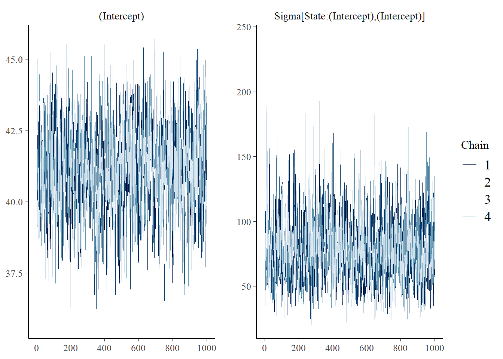
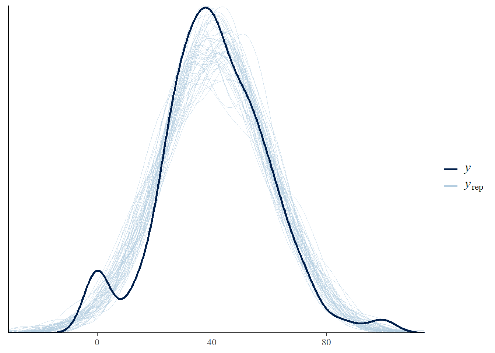
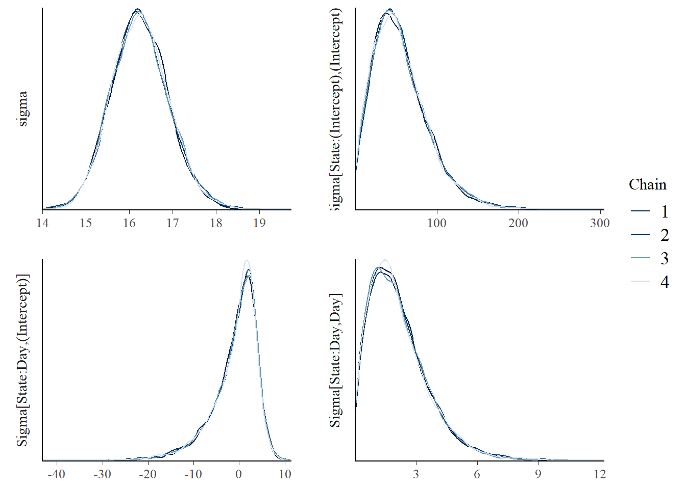
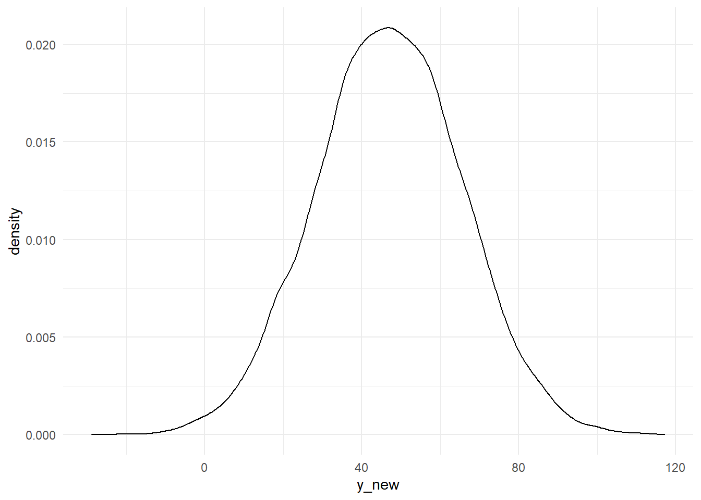

# 1. Introduction

## 1.1 Background

On March 17, 2020 President Trump referred to the Coronavirus as the "China Virus." Shortly after, throughout the subsequent weeks, there was an uptick in verbal and physical attacks against Asian-Americans (Olson, 2020). One aspect of public health that is often thrown to the wayside is how influential public officials and leaders are in disseminating public health information. Moreover, not only can their words change the public's views on a health matter but it can also shift a nation's perspective on someone's identity. The Asian Pacific Policy and Planning Council reported that in their first four weeks of receiving reports on COVID-19 anti-Asian discrimination, they received more than 1,500 incidents (Jeung & Nham 2020). This abrupt spasm of racism mimics the kind faced by American Muslims, Arabs and South Asians in the United States after the terrorist attacks of 9/11 (Tavernise & Oppel Jr, 2020). However, when President George W. Bush urged tolerance of American Muslims, this time President Trump is using language that Asian-Americans say is inciting racist attacks.

In addition, given the influence of identity politics we may expect the term "China Virus" to be more polarizing to certain identities and states.The Pew Research Center discovered that nearly three-quarters of Republicans and Republican-leaning independents view China unfavorably (Devlin, et al 2020. But the majority of reports to the AAPI were from Democrat leaning states like California, Washington and Illinois [Jeung & Nham 2020]. Moreover, states that have a higher number of reported positive cases tend to have a higher interest in Googling the term "China Virus" (2020).  Thus, this begs the question: What factors of the political, demographic and COVID-19 spheres best predicts the level of interest a state will have in the term "China Virus"? 

## 1.2 Brief Synopsis
In order to answer this question, we utilized Monte Carlo Markov Chains to build four predictive models that included some of the variables mentioned above. Model 1, a repeated measures model, is our simplest model, Model 2 is a normal regression based, Model 3 is a combination of normal and repeated measures, and Model 4, our most complex model, is longitudinal based. We then ran several different diagnostic tests such as MCMC and PP checks to evaluate the quality and structures of our models. While all the models had some different levels of predictive strength, our best model was a normal regression and repeated measures model, Model 3. This model proved to provide the best balance between complexity and quality.Model 3 captures important attributes that the normal model and repeated measures did not and it achieves similar results to our complex model, Model 4, without the heavy computational toll. Overall, we hope this project inspires others to explore the interconnection of health, communication, politics and demography. 


\
\


# 2. Data


## 2.1 Data Descriptions


Given the complexity of our research question and the limited data on COVID-19, we resorted to creating our own data set. This was done by combining multiple existing data sets from various sources that touch on different political, demographic, and COVID-19 characteristics on the state level. Our demographic data set was created using data from the US Census Bureau’s American Community Survey (ACS) which is an ongoing survey administered by the U.S. Census Bureau. It  gathers information on income, employment, housing characteristics, etc, annually for all the 50 U.S. States on the county and state level. The ACS data set was then merged with a 2016 county level election outcomes data set that was scraped from Town hall.com and Alicia Johnson’s state political leaning set which categorizes each county as belonging to a blue/red/purple state based on the state categorizations at 279town. The final merged data set was then then transformed to be on the state level and provided us with our state-level political and demographic characteristics. Google Trends data was used to measure people's interest in the term "China Virus" over time. The data was directly downloaded from the platform, for our chosen time frame of 2020-03-14 - 2020-03-21. Lastly, the COVID-19 data is provided by The COVID Tracking Project(CTP) which is updated regularly. The data points come directly from state/district/territory public health authorities—or, occasionally, from trusted news reporting, official press conferences, or from tweets or Facebook updates from state public health authorities or governors. Together these data sets allowed us to be able to tackle our question of interest. Together these data sets allowed us to be able to analyze which factors of the political, demographic and COVID-19 spheres best predict the level of interest a state will have in the term "China Virus. 


## 2.2 Variables of interest
+------------------------+---------------------------------------------------+-----------------+
| Variables:             | Description:                                      | Category:       | 
+========================+===================================================+=================+
| `State`                | State abbreviation and main identifier            | Demographic     |
+------------------------+---------------------------------------------------+-----------------+
|`Region`                | States divided into five different regions:       | Demographic     |
|                        | West, South, Mountain, Northeast, Midwest         |                 |
+------------------------+---------------------------------------------------+-----------------+
| `percent_white`        | Percent of the Population that is White           | Demographic     | 
+------------------------+---------------------------------------------------+-----------------+
| `percent_asian`        | Percent of the Population that is Asian           | Demographic     | 
+------------------------+---------------------------------------------------+-----------------+
| `StateColor`           | Political Leaning of the state. Either red, blue  | Political       | 
|                        | or purple.                                        |                 |
+------------------------+---------------------------------------------------+-----------------+
| `ChinaVirusInterest`   | Interest index from Google searches by state.     | Interest        |
|                        | Peak search day=100, all other days in set are    |                 |
|                        | based searches on relative to this peak day.      |                 |
+------------------------+---------------------------------------------------+-----------------+
| `Positive`             | Number of reported positive COVID-19 cases        | COVID-19        |
+------------------------+---------------------------------------------------+-----------------+
| `Negative`             | Number of reported negative COVID-19 cases        | COVID-19        |
+------------------------+---------------------------------------------------+-----------------+
| `Day`                  | Date of report                                    | COVID-19        |
+------------------------+---------------------------------------------------+-----------------+
| `totalTestResults`     | Total Number test results (Positive + Negative)   | COVID-19        |
+------------------------+---------------------------------------------------+-----------------+

For our variable selection process we initially grouped each variable to be either relating to Demographic, Political, COVID-19, or "Interest" characteristics. From there we chose the most robust variable out of each category, and used it to create our final models. This process resulted in a final data set containing over 400 observations and 10 out of the original 34 different variables. 

## 2.3 Visualizations 

The purpose of the visualizations below is to aid us in deepening our understanding of how our variables of interest interact with one another and how they are structured. We chose to investigate the variables that are listed above because in our background research, we found that these factors on their own have proven to indicate some kind of influence on our outcome variable, interest in the term "China Virus." With our new combined data sets, we hope to see that our intuition, background research and the data align with one another to tell an interesting narrative.

### Figure 1
preservef151ca485fbfd289

This visualization aims to establish our understanding of what our outcome variable looks like in our data across the United States. It also provides information on the distribution and geographical patterns of several variables of interest (hover for additional information). As we can see, the Google interest in the term "China Virus" is highly variable across all states. The states that are on the higher end of the scale are: Louisiana, Florida, Oklahoma, Michigan, Arizona, Nebraska, and Alaska. This implies that predicting interest in "China Virus" by region would most likely be ineffective.Additionally, the majority of these high interest states have a large number of positive reported cases. This is an interesting observation given that reporting of positive cases differs across states and may be influencing the general public differently by state. Moreover, the majority of the high interest states are also designated as "red" with the exception of Michigan which is "blue." This indicates that the variable State Color may be one of the most effective predictors for our models. This visual includes information on white and Asian percentages by state but Figure 2 provides a more informative depiction of the geographic distribution. 

### Figure 2
preservef01455f9a35915dd

With this visual we hope to illuminate what the dispersion of white identifying and Asian identifying individuals looks like by state. Our background research supports the idea that anti-Asian sentiment may occur more in places where there is a low proportion of Asian-Americans. However, this comparison of percentages highlights that the Asian population across the entire US is pretty low. This suggests that including `percent_asian` in our model will most likely be ineffective thus, it may be more informative to include `percent_white` as an indicator of diversity. While it sounds counter-intuitive the idea would be that the lower the `percent_white` is by state means that there is a higher percentage of non-white identifying individuals. Thus, this variable may prove influential in our models. 

### Figure 3

During the 2020-03-14 - 2020-03-21 week, Trump in an official press announcement labeled the Corona Virus as "China Virus" and we wanted to see how his comments affected search patterns across states.

preservea38ecc7a64e54868

This plot shows the relationship of “China Virus” search interest over our time period of interest grouped by State Color. For each State Color, we can see an overall increasing interest in the term "China Virus" but especially among the Democratic and Swing states. While this seems contradictory to our intuition this pattern can be explained by the  the complicated nature of US politics. We dug deeper into why this pattern would occur and found that Democrats tend to take more initiative in researching terms they have heard on the news, especially from the White House COVID-19 briefings, over Republicans. So while interest in the term China Virus is more popular in blue states, the intentions may be different than Red states. This finding is very important to note because when we include State Color in our models, we have to be wary on how we interpret the coefficients associated with Red, Blue and Purple.


### Figure 4

preserve6100c5c557dbff78

Figure 4 aims to address the question: What structure does interest in the "China Virus" look like and what is its variance look like too? As we can see, the majority of states behave relatively normal with a small bump at 0. One could argue against a normal distribution as some states like Delaware,Texas, Washington and Alabama look a bit right skewed but overall a normal distribution is the best at describing these densities as a whole.  Additionally, we can see that the variability in Google interest in the term China Virus is has quite a large range between states. There are very few states that have high densities among the upper echelons of the interest scale but there are some interesting peaks of densities among the lower values. For example, we can see that Alaska, Wyoming and Iowa have unusual peaks around the 25-50 range. It is is also interesting interesting to note that there isn't an *obvious* mean or median value of China Virus interest among the states. Again, this prompts more questions about the characteristics of the states themselves. While this shows us that a Normal Regression model may suffice we still explored the possibility of varying slopes among states below. 

### Figure 5
preserve23803679a3a921a8

Figure 5 helps inform us on what level of complexity our model may need to be. We originally visualized all 50 states slopes but for the purposes of this report, it is more effective to observe a select few. As we can see states like Iowa and Missouri have a negative slope which indicates that the rate of their interest in the term China Virus decreases over time. However states like Louisiana, Maryland, Michigan and Mississippi have upward slopes which indicates the opposite of Iowa and Missouri. Then there are the states that have a relatively flat slope which means rate of interest neither increases or decreases overtime. Thus, these plots tell us that we will want to explore a longitudinal model because states do seem to have varying rates of interest however, it may not be entirely necessary because the slopes do not seem to varying drastically in steepness. 


\
\


# 3. Methods & Models

## 3.1 Model 1 Repeated Measures Model
 
  For our simplest model we decided to use a repeated measures model. Our team decided that the repeated measures model was necessary component because of how our data is set up. As we can see in our data set, each state has a value for their `ChinaVirusInterest` for each day in our target period (2020-03-14 - 2020-03-21). Given the ability to use repeated measures and our prior understanding of the varying characteristics (demographic,political,covid-impact) within different states, the repeated measures model allows us to capture these differences in `ChinaVirusInterest` with the $\theta_i$ value which represents each state's mean value.
  


### 3.1a Model Structure


$$\begin{aligned}
Y_{ij}|\theta_i, \mu, \sigma_w, \sigma_b \sim N(\theta_i,\sigma_w^2)\\
\theta_i|\mu,\sigma_b \overset{ind}{\sim} N(\mu, \sigma_b^2)\\
\sigma_b,\sigma_w \sim Exp(...)
\end{aligned}$$

\
$Y_{ij} =$ `ChinaVirusInterest` per:
\
$i=State$
\
and $j= Day$ 
\
$\theta_i =$ State i's unique mean value
\
$\sigma_w =$ within state variation
\
$\sigma_b =$ between state variation


 We decided that our MCMC model should take in values from a normal distribution because ChinaVirusInterest's distribution is fairly normal. Meaning that most of the observations cluster around a central peak and then values further away taper off somewhat equally in both directions. Even though the tails are not as flat as we would want them, we decided a normal distribution was still the best fit to model ChinaVirusInterest. 
 
 


## 3. 2 Model 2: Normal Regression

For our second model, we decided that we wanted to understand what made some states more responsive to ChinaVirusInterest than others. As you saw in our research motivation section, we wanted to explore what explained the differences in interest for the “China Virus” term: Was it a political difference, a demographic or a covid-impact related difference? To do this we used a simple Normal Regression model with the following specifications. For our demographic specification we used `percent_white`, for our political specification we used `StateColor` and for our Covid-impact specification we used `positive` (#of positive cases). 

### 3.2a Model Structure

$$\begin{aligned}
Y_{i}|\beta_0, \beta_1, \beta_2,\beta_3,\beta_4 &\overset{ind}{\sim} N(\beta_0+ \beta_1X_{1i} + \beta_2X_{2i} + \beta_3X_{3i}+ \beta_4X_{4i},\sigma^2)\\
\beta_0,\beta_1, \beta_2,\beta_3 &\sim N(...,...)\\
\sigma &\sim Exp(...)\\
\end{aligned}$$


$Y = ChinaVirusInterest\\$
\
$i = state\\$
\
$j = Days\\$
\
$X_{ij} = \text{Days}\\$
\
$X_2 = \text{percent_white}\; X_3 =\text{StateColor}\;   X_4 =\text{Total Test Results}\\$
\
$\sigma = \text{Variance in }$ `ChinaVirusInterest`
\


## 3.3 Model 3: Normal Regression + Repeated Measures

For our third model, we decided to combine the first two models to be able to understand variations in political, demographic, covid-related variables and to also be able to capture variation that we could not explain in model 2. Additionally, we kept the correlation structure that we saw in model 1, but we included the variables in model 2 so that we could explain why some states had a larger `ChinaVirusInterest` than others. Similar to model 1, model 3 allows us to capture differences in `ChinaVirusInterest` with the $\theta_i$ value which represents each state's mean value.

### 3.3a Model Structure

$$\begin{aligned}
Y_{ij}|\theta,\mu,\beta_0, \beta_1, \beta_2,\beta_3,\beta_4,\sigma_w,\sigma_b &\sim N(\theta_i +\beta_1X_1 + \beta_2X_{2i} + \beta_3X_{3i}+ \beta_4X_{4i}, \sigma_w^2)\\
\theta_i|\mu, \sigma_b &\overset{ind}{\sim}N (\mu, \sigma_b^2)\\
\beta_0,\beta_1, \beta_2,\beta_3 &\sim N(...,...)\\
\sigma_w,\sigma_b &\sim Exp(...)\\
\end{aligned}$$

$Y = ChinaVirusInterest\\$
\
$i = state\\$
\
$j = Days\\$
\
$X_{ij} = \text{Days}\\$
\
$X_2 = \text{percent_white}\; X_3 =\text{StateColor}\;   X_4 =\text{Total Test Results}\\$
\
$\sigma_w = \text{within state variation} \\$
\
$\sigma_b =  \text{between state variation}\\$
\


## 3.4 Model 4: Longitudinal Model (state-specific slopes)

Because of the structure of our data, we are also able to create a longitudinal model as we have repeated measures for `ChinaVirusInterest` and corresponding observations for `Day`. In this more complex model we allow for state-specific slopes and intercepts to predict their behavior of `ChinaVirusInterest`. As the Days increase we get closer to when Trump addressed the Corona Virus as "China Virus". Thus if we see increasing slopes we might conclude that in that state, the effect of Trump addressing the Corona Virus as "China Virus" created an increase in the interest of the term and viceversa. 


### 3.4a Model Structure

$$
\begin{split}
Y_{ij} | b_0, b_1, \beta_0, \beta_1,\beta_2,\beta_3,\beta_4 ,\sigma_w, \sigma_{0b}, \sigma_{1b} & \sim N( b_{0i} + b_{1i} X_{ij}+ \beta_2X_{2i} + \beta_3X_{3i} +\beta_4X_{4i}, \; \sigma_w^2) \\
b_{0i} | \beta_0, \sigma_{0b} & \stackrel{ind}{\sim} N(\beta_0, \sigma_{0b}^2) \\
b_{1i} | \beta_1, \sigma_{1b} & \stackrel{ind}{\sim} N(\beta_1, \sigma_{1b}^2) \\
\beta_0,\beta_1,\beta_2,\beta_3,\beta_4 & \sim N(..., ...) \\
\sigma_w & \sim Exp(...) \\
\sigma_{0b} & \sim Exp(...) \\
\sigma_{1b} & \sim Exp(...) \\
\end{split}
$$
In this hierarchical model each state receives a specific slope and intercept. The first step is determined through determining the $\beta_{0} - \beta_{4}$ values which represent the intercept, slope, and our three demographic interactions that we bring in from model 3. The $\beta_{0}$ represents the intercept value for all states. From this value each state derives its individual $b_{0i}$ which represents that state’s individual intercept value. In the diagram below we see that the $b_{0i}$ values are normally distributed around the $\beta_{0}$ and are distributed by $\sigma_{0b}$. This same process occurs for determining state specific slopes however we use $\beta_{1}$ and $b_{1i}$. 

The main purpose of this model is to find the magnitude of $\sigma_{1b}$ since this deviation is what determines the significance of their truly being state level unique slopes or not, and therefore determines if we need to use this more flexible model to predict `ChinaVirusInterest`. 


\
$Y = ChinaVirusInterest\\$
\
$i = state\\$
\
$j = Days\\$
\
$X_{ij} = \text{Days}\\$
\
$X_2 = \text{percent_white}\; X_3 =\text{StateColor}\;   X_4 =\text{Total Test Results}\\$
\
$\sigma_w = \text{within state variation} \\$
\
$\sigma_{0b} =  \text{between state variation for intercept}\\$
\
$\sigma_{1b} = \text{between state variation for slopes}\\$
\
$X_{ij} = \text{Days}$
\
$b_{0i} = \text{State-Specific-Intercept}$
\
$\beta_0 = \text{Population-wide-Intercept}$
\
$b_{1i} = \text{State-Specific-Slope}$
\
$\beta_1 = \text{Population-wide-Slope}$


\
\


# 4. Model Evaluation


## 4.1 Model 1 Evaluation (Repeated measures)


### 4.1a MCMC Plots


By looking at the mcmc trace plot and density overlay we see that our MCMC chains are fairly stable. However, looking at the density overlay we can see it could do with a bit more stability as the peaks for our Intercept become more spread out around the 40-42.5 range. From the above plots, we also see that our value of $\sigma_b^2$ is greater than 0. Our value of sigma is around 75 meaning that we must include random intercepts in our final model


In the output above we see that the within deviation is much more narrow than the between deviation. This matches our intuition in the model that utilizing the repeated measures fixed effects model will be able to explain a greater amount of the variation. 


This correlation table shows us that there is relatively weak correlation within each given daily observation within a state. Although there is not a strong correlation, it is correct for us to utilize a repeated measures model in order to account for the correlation within states. 


### 4.1b Posterior Predictive Check


Overall, we can see that our repeated measures model tells us that the structure of our model is fairly reasonable. In other words, the assumption of using a normal model is fairly reasonable outside of the fact that the tails are a bit thicker than we would want them to be. This is because we are expecting a lot of states that will have multiple days with zero value, if no one in the state looks up the term. This is why our tails are a bit thicker than we would want them to be, specially around 0. 


## 4.2 Model 2 Evaluation (Normal Regression)

### 4.2a MCMC Plots


```r
# Trace plots
mcmc_trace(NR_model,pars = c("sigma","(Intercept)","percent_white","StateColorred","StateColorpurple","positive","Day"),facet_args = list(ncol = 3, strip.position = "left")) 
```


```r
# Density plots
mcmc_dens_overlay(NR_model, pars = c("sigma","(Intercept)","percent_white","StateColorred","StateColorpurple","positive","Day"),facet_args = list(ncol = 3, strip.position = "left"))
```


For this mcmc overlay and trace plot, we looked at our sigma and intercept along with our predictor values. Compared to model 1, it looks that our chains are more stable and they have closer peaks. 


### 4.2b Posterior Predictive Check


Although our posterior predictive check is pretty similar to our previous model, we see that the peaks are a bit more closer together, and similar to the previous model the structure of the GLM is fairly reasonable. 


## 4.3 Model 3 Evaluation(Repeated Reg + Normal)


### 4.3a MCMC Plots


Compared to our previous model, we see that our chains are more stable for the intercept and the percent_white variable as the peaks are closer together. We also see that our $\sigma_b^2$ is almost always above 0, and the density has a mean around 75 similar to our repeated measures model. 

### 4.3b Posterior Predictive Check 


As seen in our prior posterior predictive checks, they have similar errors around the tails. But it seems that our GLM structure is also reasonable for this model. 

## 4.4 Model 4 Evaluation (Longitudinal)

### 4.4a MCMC Plots



In the dens overlay we can see that our value for $\sigma_{1b}^2$ is close to zero but we could argue that random slopes are necessary, as the mean of  $\sigma_{1b}^2$ is around 2-2.5 and given that we are talking about slopes with not a very high range 2-2.5 is pretty good range for differing slopes. Similar to our previous dens overlay checks our value of $\sigma_b^2$ is almost always above zero and its mean is around 75, which means that random intercepts are necessary. 

### 4.4b Posterior Predictive Check 


Overall all ppchecks tend to have the similar graph because we are assuming a normal relationship on the response variable for all of them. 


\
\


# 5. Results

## 5.1 Posterior Predictions All States 


### 5.2 Table 


```
##               mae mae_scaled within_50 within_95
## Model 1  9.362509  0.5418717 0.5980392 0.9681373
## Model 2 10.622916  0.5764897 0.5490196 0.9289216
## Model 3  8.940521  0.5224663 0.6029412 0.9632353
## Model 4  8.769638  0.5027308 0.6274510 0.9656863
```

As we can see in the table above, the lowest mae was achieved by our most complex model, Model 4 which allowed for both random slopes and random intercepts. But the mae value is not that different from the mae achieved by Model 3 which was more simple allowing only for random intercepts. Interestingly Model 1 our simplest model had a higher proportion of the data falling within the 95% posterior predictive interval. 

### 5.2a Model 3 is the best

We believe that the decreases in mae and increases of the proportion of values observed within 50% of the posterior predictive interval do not justify increasing the complexity. Which is why we argue that Model 3 is the best model because it achieves similar results to model 4 without making it computationally expensive. But if we want a more precise model we would use Model 4. But out mcmc_dens and our visualizations showed that there are different slopes across states and thus a more reasonable approach would be to use Model 4. 

## 5.3 Posterior Prediction One State

### 5.3a


```
##      y_new       
##  Min.   :-15.69  
##  1st Qu.: 33.70  
##  Median : 45.57  
##  Mean   : 45.36  
##  3rd Qu.: 57.01  
##  Max.   :106.62
```

After creating predictions for all the states, we wanted to focus on just one state. That said, we looked at Florida and created future "China Virus" interest predictions for it using each of our models. Our first model, predicts "'China Virus" interest for Florida on Day 7, with the positive rate being 11% and assumes the percentage of white residents is to be 5%. Model 1 predicts the mean interest to be 45.27%, however, as one could see from the above visualization the interest could vary greatly, but there is a higher chance for it to be between 20% - 80%. 


### 5.3b


```
##      y_new       
##  Min.   :-28.83  
##  1st Qu.: 34.48  
##  Median : 46.94  
##  Mean   : 46.94  
##  3rd Qu.: 59.49  
##  Max.   :117.21
```

Model 2 looks at Florida on day 7, with the number of positive cases being 658 with the percentage of white residents being 5%. Model 2 predicts the mean interest to be 46.95% which is a lot better than model 1. However, the interest could vary greatly, and the space under the curve is much more condescended to the mean. 

### 5.3c


```
##      y_new       
##  Min.   :-25.66  
##  1st Qu.: 38.37  
##  Median : 50.16  
##  Mean   : 50.06  
##  3rd Qu.: 61.82  
##  Max.   :121.14
```

Model 3 looks at Florida on day 7, with the number of positive cases being 658 with the percentage of white residents being 5%, and also classifies Florida as a purple state. Model 3 predicts the mean interest to be 50.04%. For this model we see that the peak is around that 50%, but the range can vary from 0 to 100%. 

### 5.3d


```
##      y_new       
##  Min.   :-13.23  
##  1st Qu.: 41.31  
##  Median : 53.17  
##  Mean   : 53.14  
##  3rd Qu.: 65.11  
##  Max.   :126.43
```

Our final model predicts the same aspects as model 3. Our model predicted "China Virus" interest to be 53.16, which is a lot higher than our other models. Also, we see that the area under the curve is a lot more spread out as well. 

### 5.3e

```
## # A tibble: 1 x 1
##    mean
##   <dbl>
## 1  47.6
```

The actual mean of interest in the term China Virus in Florida is 47.625! We can use this value to assess how closely our models predicted the interest to be. 


```
## Parsed with column specification:
## cols(
##   Models = col_double(),
##   Mean = col_double(),
##   ACTUAL = col_double(),
##   Min = col_double(),
##   `1QR` = col_double(),
##   Median = col_double(),
##   `3QR` = col_double(),
##   Max = col_double()
## )
```

```
## # A tibble: 4 x 8
##   Models  Mean ACTUAL   Min `1QR` Median `3QR`   Max
##    <dbl> <dbl>  <dbl> <dbl> <dbl>  <dbl> <dbl> <dbl>
## 1      1  45.3   47.6 -16.0  33.8   45.4  56.9  108.
## 2      2  47.0   47.6 -28.8  34.5   46.9  59.5  117.
## 3      3  50.0   47.6 -22.2  38.3   50.1  61.9  128.
## 4      4  53.2   47.6 -22.2  41.2   53.3  65.1  123.
```

In this table each model's prediction of Florida on the final day of our target window compared with how the actual value in the set. We find that the predictions, especially with our more complex Models 3 & 4 are not particularly close, especially with Model 4 having an error of close to 6. However, we are aware that our MAEs are smaller in Models 3 and 4. 


## 5.4 Final Model 


\
\


# 6.Conclusion 

## 6.1 Limitations

Our data itself brings about a couple of limitations: 

**COVID-19 Data set:** 
One of the biggest weakness of this data set is the fact there there is no designed standardized method for states to follow for data collection and reporting.  For example, some states, like Oregon, provide the full set of numbers but others provide some or none of these numbers on an ongoing basis. Some crucial states in this outbreak, notably California, Washington, and New York, have not been regularly reporting their total number of people tested. This is rather concerning as there could be important trends  that are not being captured due to the under and over reporting. 

**Google Trends:** 
The main downside to the Google Trends data set is the method of the indexing that the platform uses. Since each state is guaranteed to have a 100-level interest on their peak interest day the comparison from state to state becomes less meaningful. Additionally, the actual unknown search values can vary greatly across different states. 

**Demographics & Political:** 
Overall, the demographics and political data set is rather comprehensive and accurate. However, the biggest limitation arises with the State of Alaska. Since the State of Alaska reports results at the precinct or state level so there was no county-level data available and many data sets excluded the state. Therefore, demographic and election information for Alaska had to be manually entered. 

In addition to our data limitation, a couple of limitations arose with our final models. For our models we used a Normal distribution which goes from 0 - 100, however, our final distributions turn our to be rather truncated with values going above and below 0 and 100 this causes us to have wider guesses. Also, when running a pp check on each of our models we saw that our resulting distribution wasn't a perfect normal as there were two visible bumps on each of the tail ends. These bumps would need further exploring, however, we assume them to be outliars within our data. 

## 6.2 Future Work


The Google Trends platform provided us with some interesting findings, however, it doesn't tell us how people actually responded to the term "China Virus". Thus, it would be interesting to incorporate Twitter data into the analysis. Scrapping Twitter would allow us to analyze the actual emotional response to Trump's statement and incorporate a sentimental analysis. Additionally, in the future we hope to look at how the stay at home orders impacted "China Virus" interest as well.


\
\


# 7. Acknowledgments

We thank Alicia Johnson for not only providing us an aspect of our final data set but also for helping us throughout the entirety of the project. 


# 8. References
Devlin, K., Silver, L., Huang, C. (2020). Amid Coronavirus Outbreak, Americans' Views of China Increasingly Negative. Retrieved 5 May 2020, from https://www.pewresearch.org/global/2020/04/21/u-s-views-of-china-increasingly-negative-amid-coronavirus-outbreak/

Google Trends. (2020). Retrieved 5 May 2020, from https://trends.google.com/trends/explore?geo=US&q=china%20virus

Jeung, R. Nham, K. (2020). STOP AAPI HATE MONTHLY REPORT 4/23/20. Retrieved 5 May 2020, from http://www.asianpacificpolicyandplanningcouncil.org/wp-content/uploads/STOP_AAPI_HATE_MONTHLY_REPORT_4_23_20.pdf

Olson, H. (2020). Trump’s not the only one blaming China. Americans increasingly are, too. Retrieved 5 May 2020, from https://www.washingtonpost.com/opinions/2020/05/04/get-ready-an-election-all-about-china/

Tavernise, S. Oppel Jr, R. (2020). Spit On, Yelled At, Attacked: Chinese-Americans Fear for Their Safety. Retrieved 5 May 2020, from https://www.nytimes.com/2020/03/23/us/chinese-coronavirus-racist-attacks.html
